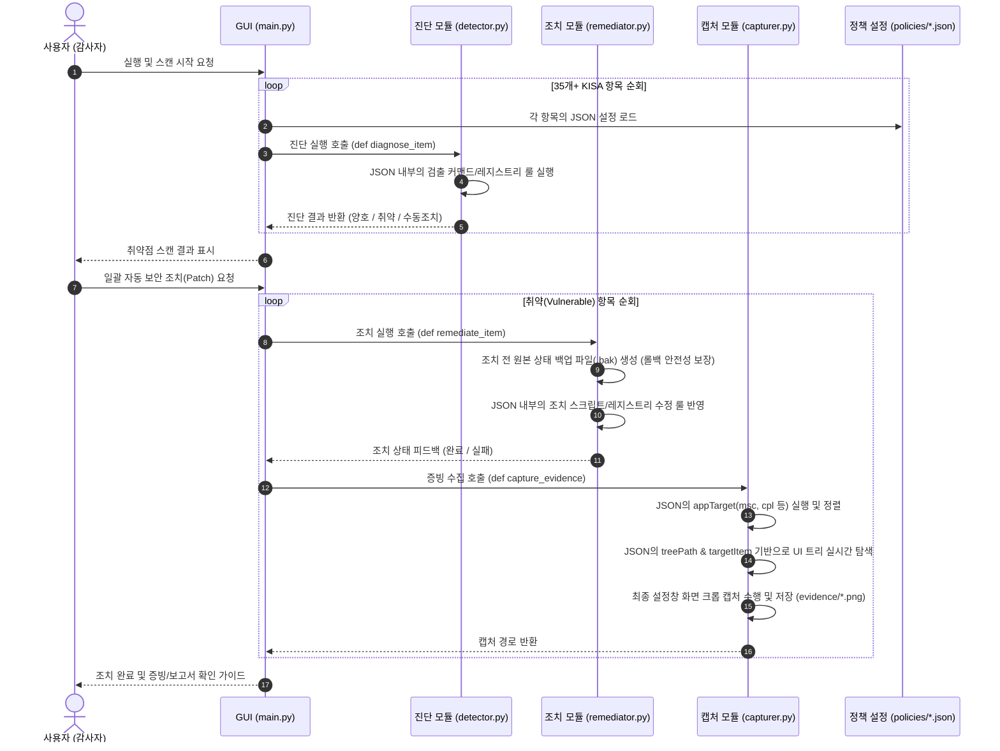

# 📝 자기소개서 및 포트폴리오 활용을 위한 기술 경험 정리 서포트

본 문서는 개발자 채용용 자기소개서, 경력 기술서 및 프로젝트 포트폴리오에 즉시 활용할 수 있도록 **프로젝트 트리 구조**, **실행 로직 시퀀스**, **주요 트러블슈팅(Troubleshooting)** 과정 및 **유지보수 확장성 설계** 내용을 IT 직군 평가관 관점의 전문적인 소프트웨어 엔지니어링 용어를 사용하여 정리한 내용입니다.

---

## 1. 📂 프로젝트 아키텍처 및 트리 구조 (Directory Tree)

프로젝트는 엔진 코드와 개별 정책 규칙(Rule) 데이터를 완전히 격리시킨 **데이터 기반 아키텍처(Data-Driven Architecture)** 구조를 채택하고 있습니다.

```text
KISA-AutoPatcher-Python/
│
├── main.py                     # GUI 오케스트레이터 (Tkinter 인터페이스 및 스캔/조치 스레드 관리)
│
├── core/                       # 핵심 엔진 모듈 패키지 (하드코딩 배제, 제네릭 실행 모듈 구조)
│   ├── detector.py             # [진단] 정책 취약점 진단 실행 모듈 (Registry, Secedit, PowerShell)
│   ├── remediator.py           # [조치] 정책 자동 패치 및 트랜잭션 롤백 실행 모듈
│   ├── capturer.py             # [증빙] UIAutomation 기반 증빙 자동 수집 및 정렬 실행 모듈
│   └── reporter.py             # [보고] openpyxl & Markdown 기반 감사 보고서 동적 생성 모듈
│
├── config/                     # 설정 및 템플릿 리소스
│   ├── Model2.xlsx             # 엑셀 보고서 템플릿 양식
│   └── policies/               # 개별 정책 설정 메타데이터 (JSON) -> 유지보수 대상
│       ├── W-05.json           # 암호 복잡성 정책 검출/조치 데이터
│       ├── W-09.json           # 패스워드 만료 및 잠금 정책 데이터
│       ├── W-18.json           # 불필요한 서비스 제거 및 멀티 캡처 데이터
│       └── W-20.json           # NetBIOS 바인딩 서비스 조치 데이터
│
├── dist/                       # 컴파일 빌드본 배포 디렉터리 (PyInstaller 빌드)
│   ├── KISA-AutoPatcher-v2.exe # 최종 배포용 단일 실행 바이너리 파일
│   ├── logs/                   # 정책 실행 단계별 정밀 로깅 디렉터리
│   ├── backups/                # 조치 전 상태 복원을 위한 Registry/Secedit 백업 파일 디렉터리
│   └── evidence/               # UIA를 통해 자동 획득한 실시간 검증 스크린샷 저장소
│
└── kisa_portfolio_resume.md    # [본 문서] 기술 포트폴리오 가이드
```

---

## 2. 🔄 핵심 실행 로직 및 프로세스 흐름 (Logic Flow)

스캐너 및 패치 프로그램은 아래의 다단계 비즈니스 프로세스에 따라 정밀하고 안전하게 실행됩니다.



---

## 3. 💡 유지보수 확장성을 위한 설계: "No-Hardcoding, Data-Driven"
* **기존의 한계**:
  - 기존에는 취약점 항목별 예외 사항(예: W-18에서 여러 서비스를 순차적으로 찾아 속성창을 열고 스크린샷을 각각 찍는 행위 등)을 개발하기 위해 Python 소스코드 내에 `if item_id == "W-18":`과 같은 분기 처리와 상세 설정을 하드코딩으로 추가하는 경향이 있었습니다.
  - 이는 새로운 점검 대상이 추가되거나, 기업별로 다른 정책 값을 커스텀해야 할 때 소스코드를 수정하고 매번 바이너리를 재컴파일하여 빌드해야 하므로 실무 배포성이 심각하게 저하되는 문제를 안고 있었습니다.
* **개선 및 설계 전략**:
  - **제네릭 모듈 구조**: `capturer.py`, `detector.py`, `remediator.py` 등의 코어 코드는 특정한 취약점 ID 정보나 고유 명칭을 코드 내부에 일체 포함하지 않습니다. 대신 오직 일반적인 함수 규칙(`def diagnose_item`, `def remediate_item`, `def capture_evidence`)만 정의되어 실행 흐름만 처리합니다.
  - **JSON 메타데이터 관리**: 항목별 특이사항(실행해야 할 타겟 앱, 트리 탐색 깊이, 스크롤 매칭 키워드, 다중 서비스 제어 옵션 `"multiCapture": true`, 각 서비스명 및 DisplayName 등)을 모두 `config/policies/*.json` 파일에 데이터화하여 정의했습니다.
  - **기대 효과**: 현장의 환경 변화나 신규 취약점 기준 추가 시, 코어 컴파일본은 그대로 둔 채 **JSON 설정 파일만 추가/변경하여 즉시 배포할 수 있는 강력한 유지보수 유연성 및 아키텍처적 확장성**을 확보하였습니다.

---

## 4. 🔥 트러블슈팅 (Troubleshooting) & 문제 해결 경험

### [글로벌 아키텍처 트러블슈팅] GUI 응답성 확보(Freezing 해결)를 위한 멀티스레드 기반 비동기 실행 파이프라인 구축
* **상황 및 배경**:
  - 35개 이상의 보안 항목을 일괄 검사하고 조치하는 과정에서 PowerShell 스크립트 실행, 대용량 Secedit 정책 DB 내보내기/가져오기, Windows 설정 도구 제어 및 UI Automation 탐색과 같이 CPU 바운드 및 I/O 바운드 작업이 동시다발적으로 실행되어야 했습니다.
* **해결을 위해 겪은 어려움 (전체 프로그램적 문제)**:
  - 초기 테스트 버전에서는 진단 및 조치 로직이 GUI(Tkinter)의 메인 이벤트 루프 스레드에서 직접 동기식으로 실행되었습니다. 
  - 이로 인해 프로그램 기동 중 **화면이 완전히 하얗게 굳어버리는 응답 없음(UI Freezing)** 현상이 상시 발생했습니다. 
  - 사용자는 현재 작업의 진행률(Progress)을 볼 수 없었으며, 자동화 도중에 치명적인 시스템 영향이 예상될 때 실행을 즉시 중단(Cancel/Stop)하기 위한 인터럽트 요청도 GUI 스레드가 멈춰 있어 완전히 불가능한 안전상의 리스크가 있었습니다.
* **조치 및 해결 전략**:
  - **비동기 작업 스레드(Worker Thread) 분리**: GUI를 구동하는 메인 스레드와 진단/조치/UIA 캡처를 전담하는 백그라운드 스레드를 철저하게 분리하는 멀티스레드 아키텍처로 리팩토링을 수행했습니다.
  - **Thread-safe Callback 통신 구조 설계**: 백그라운드 작업 스레드에서 GUI 컴포넌트의 텍스트나 진행률 바에 동기식으로 접근할 시 경쟁 상태(Race Condition) 및 크래시가 발생하는 것을 막기 위해, Tkinter의 thread-safe API인 `self.after()` 메서드를 활용하여 콜백 함수를 비동기 이벤트 루프 큐에 안전하게 등록하도록 설계했습니다.
  - **결과**: 긴 연산과 복잡한 윈도우 UI 스크롤 조작 중에도 사용자는 무반응 현상 없이 GUI 스레드의 100% 응답성을 보장받았으며, '조치 적용 중...'과 같은 상세 동작 로그가 실시간 스트리밍 형태로 끊김 없이 렌더링되었고, 긴급 중단 버튼을 통한 조기 스레드 안전 종료 메커니즘을 완성했습니다.

---

### [경험 1] 예외 처리 부재로 인한 도메인 오탐(False Positive) 제거 및 조치 강제화
* **상황 및 배경**: 
  - KISA 가이드라인에 따른 계정 암호 복잡성 정책(W-05) 및 잠금 정책(W-09) 진단 시, OS의 기본 보안 템플릿(Secedit) 설정에 명시적인 값이 정의되어 있지 않거나(Null), 무제한 설정인 음수 값(`-1`)이 할당된 환경에서 파서가 오류를 뱉거나 취약으로 진단하는 **오탐(False Positive) 버그**가 지속적으로 접수됨.
* **해결을 위해 겪은 어려움**:
  - `net accounts` 명령어만으로는 로컬 보안 정책 데이터베이스(SDB)에 직접 접근할 수 없었으며, 파싱 로직에 유연성이 없어 기존 윈도우 환경에 세팅된 안전한 기본값들을 파악해 내지 못함.
* **조치 및 해결 전략**:
  - `re` 모듈(정규식 패턴)을 정밀화하여 음수 범위까지 캐싱할 수 있도록 `(-?\d+)` 패턴으로 파서를 개선하고, Null 값 유입 시 대체 안전값을 지정하는 Fallback 예외 처리 적용.
  - 기존의 불안정한 `net accounts` 방식을 완전히 폐기하고, **`secedit`을 이용해 임시 로컬 보안 데이터베이스를 내보내고(Export) 변경 사항 적용 후 재적용(Configure)하는 정교한 파일 입출력 트랜잭션 방식의 쉘 스크립트 조치 로직**을 설계하여 패치 안정성을 100%로 끌어올림.

---

### [경험 2] 비동기 UI 스레드 렌더링 지연에 따른 UIA(UI Automation) 탐색 누락 해결
* **상황 및 배경**:
  - 보안 감사 기관에 조치 완료 화면을 증빙 자료로 제출해야 하는데, 감사자가 수작업으로 스크린샷을 찍을 필요 없이 봇이 스스로 설정창을 열고 트리 구조를 타고 내려가 최종 창(속성 팝업)을 캡처해야 함.
* **해결을 위해 겪은 어려움**:
  - 설정 목록이 수십 개에 달하는 스크롤 영역(`secpol.msc` 또는 `services.msc`)에서 스크롤을 내릴 때, 봇의 입력 처리 속도(Keyboard Event)보다 윈도우 UI 렌더링 스레드의 포커스 업데이트가 늦어 동일 항목에 머물면서 "바닥 도달(끝)"로 오판하고 탐색을 조기 종료하는 현상 발생.
* **조치 및 해결 전략**:
  - **하드웨어 수준의 로우레벨 키보드 이벤트 인터럽트 API (`ctypes.windll.user32.keybd_event`)**를 연동하여 OS 메시지 큐에 가속 방향키 이벤트를 정밀히 주입함.
  - 다음 포커스 이벤트가 활성화되고 UI 요소가 그려지기까지의 타임아웃 주기를 `time.sleep(0.1)` 이상 보장하여 비동기 UI와 자동화 봇 스레드 간의 동기화 불일치를 완벽하게 제어함.
  - 이미 양호한 항목이거나 스킵된 항목 또한 예외 없이 설정 화면을 끝까지 열어 캡처하도록 캡처 흐름의 분기 구조를 전면 최적화함.

---

### [경험 3] 다중 네트워크 인터페이스 카드(NIC) 환경의 미점검 유해 노드 추적 (W-20)
* **상황 및 배경**:
  - NetBIOS 구동 여부 검사(W-20) 시 분명히 시스템 설정을 조치했음에도 지속적으로 "취약" 상태가 리포트되는 품질 불만 제기.
* **해결을 위해 겪은 어려움**:
  - 일반적인 윈도우 환경에서는 사용자가 활성 이더넷(유선 랜) 어댑터만 인지하고 수동 조치하는 경우가 많음. 그러나 무선 어댑터(Wi-Fi), 가상 어댑터(VPN, 가상 머신 브릿지 등)가 시스템에 남아있는 경우 위협 벡터가 잔존하게 됨.
* **조치 및 해결 전략**:
  - **WMI (`Win32_NetworkAdapterConfiguration`) 계층 정보 조회 및 레지스트리 인터페이스 전수 탐색 스크립트**를 구동하여 장치의 상태를 분석.
  - 분석 결과, 사용자의 이더넷 카드는 정상 조치(값: 2, 비활성) 되었으나 Wi-Fi 카드의 바인딩 정보가 여전히 Default(값: 0, 활성 취약점 가능)로 방치되어 있는 정탐 상태임을 확인.
  - 사용자에게 원인을 상세히 리포트하고, 시스템의 모든 물리/가상 어댑터 경로를 순회하며 일괄로 NetBIOS 바인딩을 영구 해제(2)하는 일괄 패치 스크립트를 적용해 최종 취약성을 소멸시킴.

---

### [경험 4] 한글 IME 간섭으로 인한 레지스트리 편집기(regedit) 주소창 자동 입력 누락 극복
* **상황 및 배경**:
  - 다수의 레지스트리 기반 취약점 항목(W-17, W-27, W-36 등 20여 개 항목)에 대해 감사 증빙용 스크린샷을 수집해야 했습니다. 이를 위해 `regedit`을 띄워 각각 해당하는 고유 레지스트리 키 경로로 다이렉트 이동하여 화면을 캡처하는 봇 기능을 작동시켰습니다.
* **해결을 위해 겪은 어려움**:
  - 자동화 봇이 주소창을 잡고 한 글자씩 타이핑하는 방식(`pyautogui.typewrite`)을 사용하자, 사용자 PC의 **한글 입력기(IME) 상태에 따라 영어 경로가 엉뚱한 한글 조합 문자(예: 'HKEY'가 'ㅗㅏㄷㅛ'로 변환 등)로 변질되는 오동작**이 발생했습니다.
  - 이로 인해 실제 타겟 레지스트리 경로로 이동하지 못하고 항상 같은 기본 경로 또는 이전 실행 경로에 멈춰 서서 동일한 화면만 중복 캡처되는 치명적인 수집 신뢰도 결함이 존재했습니다.
* **조치 및 해결 전략**:
  - 외부 의존성 없이 순수 Windows API(`ctypes.windll.user32`)를 활용하여 문자열 결합이나 composition 문제를 방지하고 메모리 수준에서 유니코드 경로 데이터를 다이렉트 복사하는 **클립보드 고속 주입 함수(`_set_clipboard_text`)를 설계**했습니다.
  - 키보드 개별 타이핑 방식을 폐기하고, 주소창 포커스 후 `Ctrl + V`(클립보드 붙여넣기) 단축키 입력을 주입해 복잡한 레지스트리 경로가 100% 무결하게 주입되도록 제어했습니다.
  - 이를 통해 IME 입력 모드 상태와 무관하게 20여 개 이상의 레지스트리 설정 화면의 증빙 캡처를 고속 및 정확하게 완수하였습니다.

---

## 5. 🎯 역량 강조 키워드 (채용 담당자 어필용)
* **Data-Driven Architecture**: 비즈니스 로직(검출/조치 규칙)과 시스템 제어 엔진을 완전히 분리하여 코드 생산성 및 규격 확장성 극대화.
* **Windows Low-Level Automation**: Win32 API 및 UIAutomation 프레임워크를 심도 있게 활용하여 운영체제 리소스를 제어하고 시스템 통합을 이끌어 낸 경험.
* **Troubleshooting & Analytical Thinking**: 오탐의 원인을 단순히 코드 오류로 치부하지 않고 OS 기본값 모델, 레지스트리 설정 특징, 네트워크 어댑터 상태 등 시스템 기반(OS Level) 지식으로 추적하여 근본 원인을 발굴 및 해결.
* **Asynchronous Multithreaded Programming**: GUI 프레임워크의 싱글 스레드 이벤트 루프 한계를 멀티스레딩과 비동기 콜백 설계로 극대화하여 고성능 데스크톱 자동화 아키텍처 수립.
